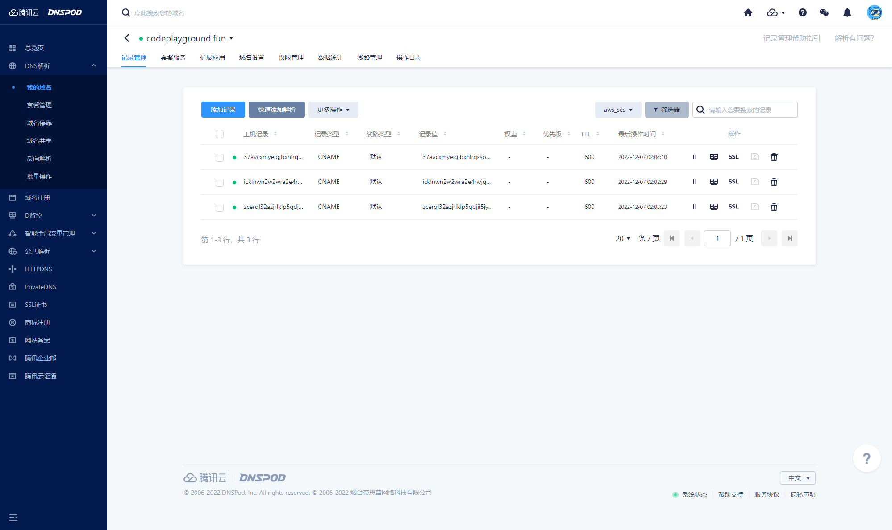
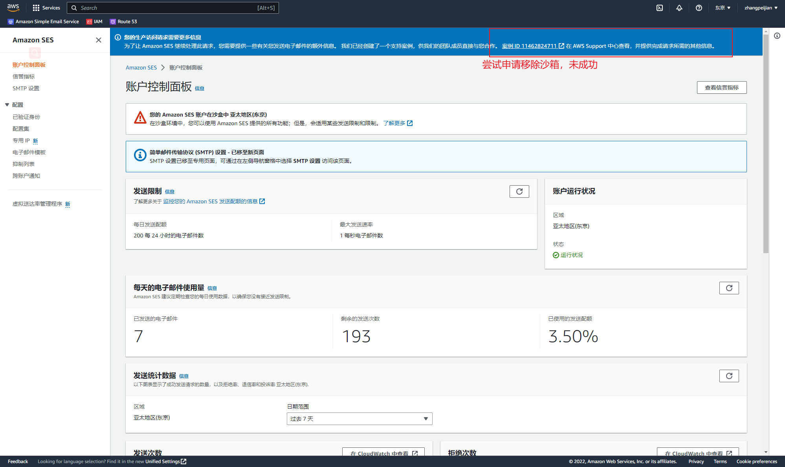
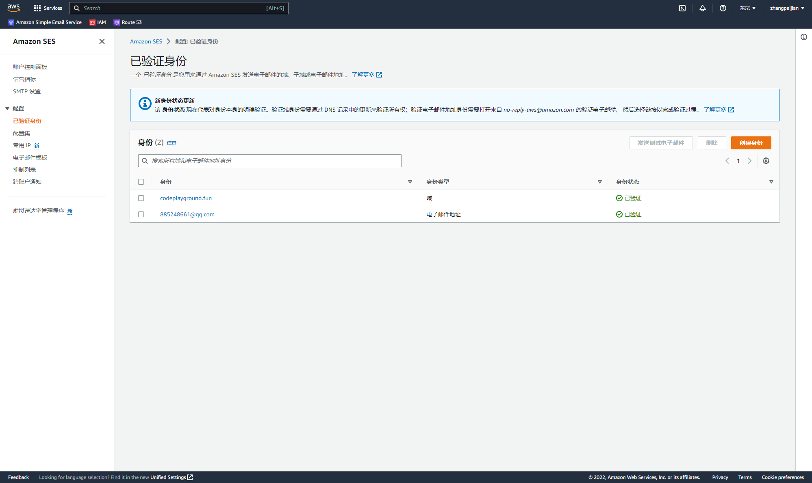

# AWS-SES-DEMO

## 描述

使用了亚马逊云 简单邮件服务，实现的简单发送邮件demo

SES账户在沙箱中，尝试申请移除沙箱失败了，只做了沙箱模式下的发送邮件功能（只能已验证邮箱间互发）

## 过程简单记录

codeplayground.fun

腾讯云域名开启DNS解析，添加验证记录

注册AWS账户，AWS SES控制台

创建身份 -> 验证域名、邮箱

创建IAM用户，本地添加身份凭证文件

借鉴发送邮件代码

最终实现已验证邮箱间互发

## 参考文档

[Amazon Simple Email Service Documentation](https://docs.aws.amazon.com/ses/index.html)

[aws-doc-sdk-examples](https://github.com/awsdocs/aws-doc-sdk-examples/tree/main/javav2/example_code/ses/src/main/java/com/example/ses)